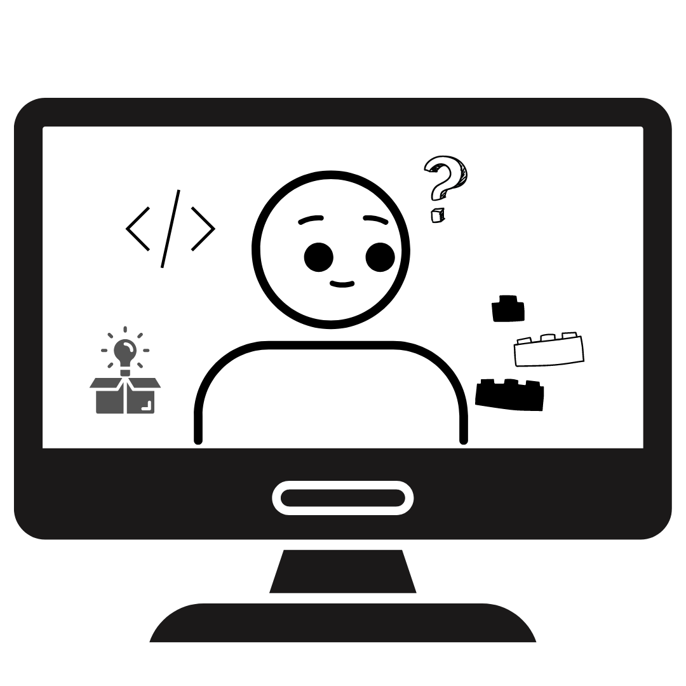

    
    

        
        
        
    

    

<h1>
  ciao
  
</h1>
I am most familiar with **Python** and **JS**, but willing and able to quickly learn others.
Passionate about automating away the boring stuff.
Keen interest in hackathons and competitions. Open to collaborate uwu! ༼ つ ◕_◕ ༽つ

Dropping a nugget for entertainment and also very apt in describing my current situation:
> Why spend 10 mins everyday doing the same task when you can spend 1 month trying to automate it ;)

<!---
BenjaminChun/BenjaminChun is a ✨ special ✨ repository because its `README.md` (this file) appears on your GitHub profile.
You can click the Preview link to take a look at your changes.
--->
